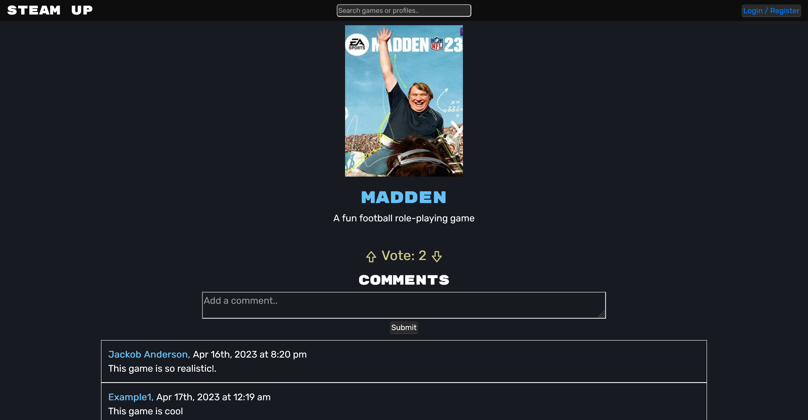

## Steam-🆙

## Table of Contents
- [Description](#description)
- [Deployed-Application](#deployed-application)
- [GitHub](#Github)
- [Presentation](#presentation)
- [Contribution](#contribution)
- [Questions](#questions)
- [License](#license)
  
## Description
Steam-up is a social gaming interactive application that allows users to create a profile, see top games and vote on what they're most intrested in and the ability to add comments. 
  
## Deployed Application

https://t4-steam-up.herokuapp.com/
  
## Github

https://github.com/lutz143/steam-up

## Presentation

[View our presentation on Google Slides](https://docs.google.com/presentation/d/16FFgj7svFV0w0SE1pqvaS_-Ivr1sdOFAdu9A1AUlI8w/edit#slide=id.g22dd8cedbb0_0_15)

## Contribution

[RetroTechCode](https://github.com/RetroTechCode)  
[lutz143](https://github.com/lutz143)  
[WarfaHa](https://github.com/WarfaHa)  
[Jdanders99](https://github.com/Jdanders99)  
[Projectmayhem90](https://github.com/Projectmayhem90)  

## Questions

**If you have any additional questions please reach out to me here**:
- Github: [lutz143](https://github.com/lutz143/steam-up)  

## License
This application uses the MIT license. [Find more information here.](https://choosealicense.com/licenses/mit/)
